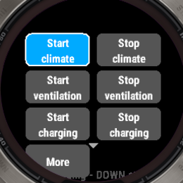
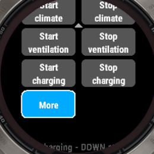
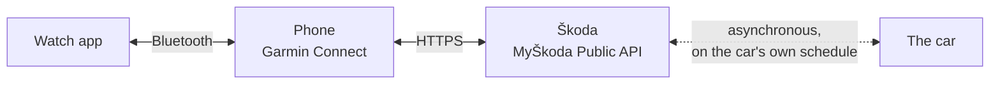

# Vozidlo


A Connect IQ watch app that reads and controls a Škoda from the wrist, through
the official MyŠkoda Public API. Charge, climate, lock status, and where the car
is parked.

*Vozidlo* is Czech for "vehicle". The app is named that rather than after the
marque, because no third-party licence exists for the Škoda marks and the brand
belongs in a compatibility statement, not in a product name.

> **Independent, unofficial app.** Not affiliated with, endorsed by, or
> sponsored by Škoda Auto a.s. or the Volkswagen Group.

## Status

**Tested on one watch, a fēnix 7 Pro.** The other five supported devices are
verified in the simulator and against the included mock server, and nothing
more. They are claimed on the strength of identical device family, memory
budgets and API implementations rather than on anyone having worn one.

Worth weighing before relying on it. The two worst bugs found so far were a
glance that crashed on every launch, and onboarding text drawn off both edges
of the screen. Both compiled cleanly and passed the entire test suite. Both
were found by looking at the screen. The post-mortems are in
[docs/decisions.md](docs/decisions.md).

It is a spare-time project. Issues get answered in days, not hours.

## What it does, and does not

| | |
|---|---|
| See the vehicle's state | Yes, charge, range, lock status, doors, odometer |
| Start and stop the air conditioning | Yes, with a target temperature |
| Start and stop charging | Yes, plus charge limit and mode |
| Find where the car is parked | Yes, address, bearing, map, navigation |
| Glance and complications | Yes, on an existing watch face |
| **Lock or unlock the car** | **No.** The API has no such endpoint |

<p align="center">
  
  &nbsp;&nbsp;
  
</p>

The controls, and the same screen scrolled one row so the overflow tile is
whole. Only three rows of tiles fit on a round face, so the grid moves rather
than letting the bottom one disappear under the bezel; the small carets show
what is off screen. Both captures are from the simulator.

## How it reaches the car



A Connect IQ app cannot open a socket. Every request is proxied through the
Garmin Connect app on the paired phone, which performs the actual HTTPS call.
There is no server belonging to this project anywhere in that path, and nothing
to add one for, which is why the [privacy policy](docs/privacy-policy.md) is
unusually short.

The dotted link is where the surprises come from. Škoda talks to the car on the
car's schedule, not on yours:

- **A command reports "sent", not "succeeded".** The API is fire-and-forget. The
  car might be in an underground car park.
- **The data is not live.** It is whatever the car last uploaded: sometimes
  minutes old, sometimes hours. Every section shows its own age.

And two consequences of the solid links:

- **No phone in range, no data.** The app keeps showing what it last saw, with
  the age beside it.
- **Each user needs their own API key**, created in the MyŠkoda app. Keys last
  about 180 days and there is no renewal.

## Supported watches

| Device | Connect IQ | |
|---|---|---|
| fēnix 7 Pro | 5.2.0 | incl. Solar, Sapphire Solar, Sapphire Dual Power |
| fēnix 7 | 5.2.0 | incl. quatix 7, Sapphire Dual Power |
| fēnix 7 Pro Solar (no Wi-Fi) | 5.2.0 | |
| fēnix 8 Solar 47mm | 6.0.2 | |
| fēnix 9 Pro Solar 47mm | 6.0.3 | |
| Forerunner 955 | 5.2.0 | incl. 955 Solar |

All six are device family `round-260x260`, which is why one set of layouts
covers them. **Adding another watch is often a two-line change**:
[docs/adding-a-watch.md](docs/adding-a-watch.md) is the full procedure, and
pull requests adding devices are the most welcome kind.

The Forerunner 255 is deliberately excluded even though it builds perfectly.
That is not an oversight, and the reason is the single most useful thing in that
guide.

## Installing

See [INSTALL.md](INSTALL.md). In short: build it, upload it to your own Garmin
developer account as a beta app, install from the link. App settings only reach
a watch through the store, so a plain sideload gives you an app with nowhere to
type an API key.

## Developing

```bash
git clone git@github.com:qr/Vozidlo.git && cd Vozidlo

cd tools && docker build \
  --build-arg UID=$(id -u) --build-arg GID=$(id -g) --build-arg HOME_DIR="$HOME" \
  -t ciq:22.04 .

tools/ciq sdkmanager     # once: sign in, download the device files
tools/ciq run            # build and launch in the simulator
tools/ciq test           # 155 unit tests
tools/ciq build --all    # every supported device
tools/ciq                # no arguments: prints the commands and device list

mock/run.sh              # the mock server to develop against
```

The toolchain runs in a container because the Connect IQ SDK Manager and
simulator link `webkit2gtk-4.0` against `libsoup2`, and Ubuntu 24.04 ships only
4.1 with `libsoup3`, which cannot coexist in one process.

Develop against `mock/` rather than a real car: 20 requests per hour per vehicle
is not much, and the mock reproduces the measured response shapes, including
the ones that look like bugs, plus the failures you cannot trigger on demand.

## The rule that matters most

If you are writing any Connect IQ HTTP client, this is the thing worth copying.
Two nearly identical calls with opposite settings, measured against the real API
rather than reasoned about:

```monkey-c
// Reading status -> :responseType MUST be set, or error detail is lost.
{ :method => Communications.HTTP_REQUEST_METHOD_GET,
  :headers => { "X-API-Key" => key },
  :responseType => Communications.HTTP_RESPONSE_CONTENT_TYPE_JSON }

// Sending a command -> :responseType MUST be omitted, or every success
// looks like a failure. Škoda's 202 has an empty body and no Content-Type,
// which Connect IQ cannot parse, so it hands back -400.
{ :method => Communications.HTTP_REQUEST_METHOD_POST,
  :headers => { "X-API-Key" => key } }
```

## Documentation

| | |
|---|---|
| [docs/adding-a-watch.md](docs/adding-a-watch.md) | How to support another device |
| [docs/decisions.md](docs/decisions.md) | Why the code is shaped this way, including the bugs that shipped |
| [docs/best-practices/garmin-connect-iq.md](docs/best-practices/garmin-connect-iq.md) | Connect IQ rules, from official Garmin sources |
| [docs/requirements.md](docs/requirements.md) | What the `US-nnn` ids in the comments mean |
| [CONTRIBUTING.md](CONTRIBUTING.md) | How to help |
| [SECURITY.md](SECURITY.md) | Where the API key lives, and what is worth reporting |

## Contributing

Pull requests are open to anyone. No CLA, nothing to sign. Using AI to write
them is fine: say so, and make sure the change makes sense.
[CONTRIBUTING.md](CONTRIBUTING.md) has the details.

## Licence

[Apache-2.0](LICENSE). Do what you like with it.

Section 6 of that licence grants no trademark rights, and none are available
here: no third-party licence exists for the Škoda marks. The name is used as a
plain word to describe compatibility, the icon is original, and no Škoda logo,
brand colour or typeface appears anywhere. Anyone forking and publishing this
inherits that constraint, see [NOTICE](NOTICE).
