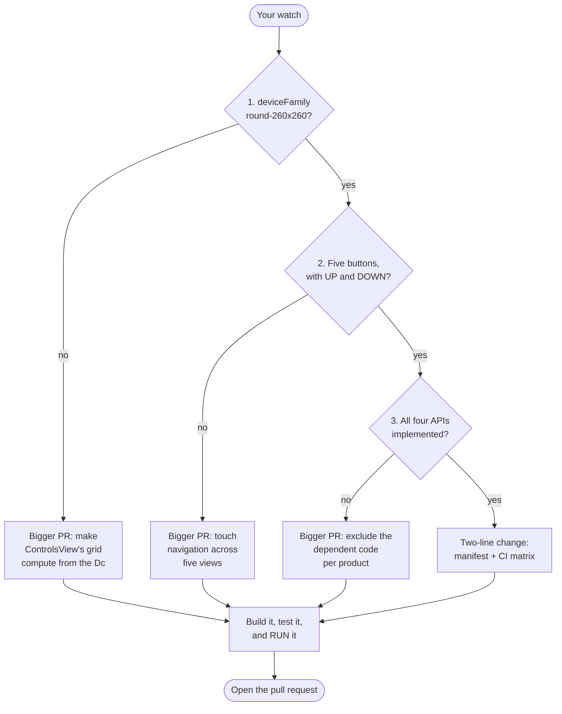

# Adding your own watch

This app supports six watches. Adding a seventh is often a two-line change, and
this guide is the whole procedure.

It is written to be followable if you have never touched this codebase. If a
check fails, skip to [When a check fails](#when-a-check-fails): a failure is
usually a bigger pull request, not a dead end.

**The one thing to take away:** a clean build does not mean a device works.
Section 3 explains why, and it is the reason this guide exists.



Every path ends at the same place. A failed check means a larger change, never
a closed door.

## What you need

The Connect IQ SDK and the device files for the watch you care about, both from
the SDK Manager (a free Garmin account; see
[CONTRIBUTING.md](../CONTRIBUTING.md#setting-up)). Everything below reads files
the SDK Manager has already put on your machine:

```
~/.Garmin/ConnectIQ/Devices/<device-id>/
├── compiler.json                 # family, memory budgets, Connect IQ version
├── simulator.json                # physical buttons
└── <device-id>.api.debug.xml     # which APIs are actually implemented
```

The `<device-id>` is the directory name: `fenix7pro`, `fr955`, `venu3`. It is
not the retail name and you often cannot guess it, so look at the directory
listing.

---

## 1. Is it the right screen family?

```bash
ID=fenix7xpro   # yours

python3 -c "
import json,os
c=json.load(open(os.path.expanduser(f'~/.Garmin/ConnectIQ/Devices/$ID/compiler.json')))
print('family :', c['deviceFamily'])
print('name   :', c['displayName'])
print('memory :', [(t['type'], t.get('memoryLimit')) for t in c['appTypes']])
print('ciq    :', sorted({p['connectIQVersion'] for p in c['partNumbers']}))"
```

You want:

| | |
|---|---|
| `deviceFamily` | `round-260x260` |
| `watchApp` memory | comfortably above 256 KB: the app is about 255 KB |
| `glance` memory | 65,536 |
| Connect IQ | 5.2.0 or higher, matching `minApiLevel` in `app/manifest.xml` |

A different family is not a no. It means `ui/ControlsView.mc` needs work: its
tile grid is plain constants (`_TILE_W = 90`, `_COL0_X = 35`, `_ROW0_Y = 52`)
rather than geometry computed from the `Dc`. Making those adapt is a real but
bounded change, and it would unlock several devices at once.

Text is already fine at any size: `ui/TextBlock.mc` wraps to the chord
available at each line's height, so it needs no per-device tuning.

---

## 2. Does it have the buttons?

```bash
python3 -c "
import json,os
print([k['id'] for k in json.load(open(os.path.expanduser(
  f'~/.Garmin/ConnectIQ/Devices/$ID/simulator.json')))['keys']])"
```

Five keys (`enter, up, menu, down, esc`) means the existing navigation works
unchanged.

Fewer means an input redesign, not a tweak. `ControlsView`, `StatusView`,
`ChargingLimitView`, `ChargingProfilesView` and `TargetTemperatureSettingsView`
all handle `onPreviousPage`/`onNextPage`, and tile navigation uses
`setKeyToSelectableInteraction`. For example the Venu 3 has three keys and the
Venu 4 has two, neither with UP or DOWN, so both need touch navigation
throughout.

---

## 3. Are the APIs actually implemented?

**This is the step that matters, and the one that looks skippable.**

```bash
f=~/.Garmin/ConnectIQ/Devices/$ID/$ID.api.debug.xml
for sym in Toybox_WatchUi_MapView Toybox_Complications \
           Toybox_PersistedContent Toybox_WatchUi_GlanceView; do
  echo "$sym: $(grep -c $sym $f)"
done
```

Expect roughly `9 / 23 / 21+ / 9`. **A zero disqualifies the device.**

### Why this is not paranoia

The Forerunner 255 is the same device family as the fēnix 7, the same Connect
IQ version, has more than enough memory, and **builds perfectly** at the
project's strictest settings:

```
$ tools/ciq build --all
BUILD SUCCESSFUL
Built app/bin/vozidlo-fr255.prg for fr255: 251436 bytes (31% of budget)
```

No errors. No warnings. And:

```
$ grep -c Toybox_WatchUi_MapView ~/.Garmin/ConnectIQ/Devices/fr255/fr255.api.debug.xml
0
$ grep -c Toybox_WatchUi_MapView ~/.Garmin/ConnectIQ/Devices/fenix7pro/fenix7pro.api.debug.xml
9
```

The Forerunner 255 has no onboard maps. `WatchUi.MapView` type-checks against
it, so the compiler is satisfied, but there is no implementation behind the
type. `ui/MapPreviewView.mc` extends `WatchUi.MapView` at class level, so the
class cannot resolve on that watch.

A green build tells you the compiler was satisfied. It tells you nothing about
whether the app loads. This project has shipped two bugs of exactly that shape:
a glance that crashed on every launch, and text drawn off both edges of the
screen, and both compiled cleanly and passed the entire test suite.
[decisions.md](decisions.md) has both post-mortems.

---

## 4. Make the change

Two files, and they must agree.

**`app/manifest.xml`**: add the product and a line to the comment block saying
what it covers and what you checked:

```xml
<iq:product id="fenix7pro"/>
<iq:product id="your-device-id"/>
```

**`.github/workflows/build.yml`**: add it in *two* places: the `matrix.device`
list, and the `matrix` string inside the "Check the matrix still matches the
manifest" step. That step fails the build when the two disagree, which is
deliberate: a product in the manifest but not in CI would ship untested.

Note the first product in the manifest is the primary: the one `tools/ciq
build`, `run` and `test` use by default. Leave `fenix7pro` there unless you have
a reason.

---

## 5. Verify

```bash
tools/ciq build --all           # every product, clean, no warnings
CIQ_DEVICE=$ID tools/ciq test   # the unit suite on your device
CIQ_DEVICE=$ID tools/ciq run    # actually look at it
```

**Run it, do not only build it.** Press through the screens. Open the glance:
a fresh simulator renders the glance before the app, which is the cheapest
guard this project has against the scope bug described in `decisions.md`.

If you own the watch, install it and use it for a day. See
[INSTALL.md](../INSTALL.md).

---

## 6. Open the pull request

The template asks for the output of the commands above. Paste it rather than
ticking boxes from memory: it is the evidence the device decision rests on,
and it takes a reviewer ten seconds to confirm.

Say plainly whether you own the watch. **"I own this and used it for a week" is
worth more than everything else in the PR.** If you do not own it, say that
too: the change will still be considered, it will just be described honestly in
the store listing, which promises nothing untested.

---

## When a check fails

None of these is a refusal. They are all larger pull requests, and all of them
are welcome: just say in the PR which one you are doing, so it gets reviewed
as the change it is.

**Wrong screen family.** Make `ControlsView`'s grid compute from the `Dc`
instead of constants. This unlocks the 7S and 7X Pro and the 42 mm and 51 mm
fēnix 8 and 9 together, so it is the highest-value change on this list.

**A missing API.** Move the dependent code behind an annotation and exclude it
per product in the jungle. For a device with no `MapView`, that means
`ui/MapPreviewView.mc`: and `ui/LocationView.mc` already guards
`WatchUi has :MapView` at runtime and falls back to bearing and distance, so
the fallback path exists and works.

**Too few buttons.** Add touch navigation to the five views listed in section 2.
This is the largest of the three, and it is what the Venu family needs.

**Not enough memory.** Probably genuinely out of reach. The app is around
255 KB and the glance arena is a hard 65,536 bytes.

---

## Currently supported

| Device id | Watch |
|---|---|
| `fenix7pro` | fēnix 7 Pro, incl. Solar, Sapphire Solar, Sapphire Dual Power |
| `fenix7` | fēnix 7, quatix 7, Sapphire Dual Power |
| `fenix7pronowifi` | fēnix 7 Pro Solar (no Wi-Fi) |
| `fenix8solar47mm` | fēnix 8 Solar 47mm |
| `fenix9prosolar47mm` | fēnix 9 Pro Solar 47mm |
| `fr955` | Forerunner 955, 955 Solar |

Deliberately excluded, with the reasoning in `app/manifest.xml`:

| Device | Why |
|---|---|
| `fr255`, `fr255m` | No `MapView` implementation: section 3 |
| 7S / 7X Pro, 42 & 51 mm fēnix 8 / 9 | 240×240 and 280×280, different family |
| Venu 3, 3S, 4 | No `MapView`, two different families, and two or three buttons |
| fēnix 6, vívoactive 4, Approach S62 | Connect IQ 3.x, below `minApiLevel`; the fēnix 6 also has half the memory needed and no glance support |
