# Night Panel style guide

How Vozidlo's screens look, read and behave, with the code that draws them. It
is for anyone (person or agent) adding or changing a screen. It describes what
the app does now; where the code and this guide disagree, one of them is a
bug, and [Known deviations](#10-known-deviations) lists the ones we know of.

## 1. What this is

Night Panel is the 1.1.0 interface: black screens, one accent colour, words
before colour, and everything measured against the circle. The proposal and
its reasoning live in [ui-improvements.md](ui-improvements.md) (Part B and C)
and in [decisions.md](../decisions.md#night-panel-navigation); this guide does
not repeat them, it tells you which rule to follow and which function already
follows it.

The code is small and shared. Every screen draws through these modules in
`app/source/ui/`:

| Module | What it holds |
|---|---|
| `Theme.mc` | Colour tokens, margins, transitions, `Theme.c()` for the monochrome test, measured row height |
| `Ui.mc` | Pure fitting helpers (`fit`, `usable`, `wrapFit`, `pickFont`) and the title, hero and status line drawing |
| `Chips.mc` | Status chips: one icon and one word in a pill |
| `Bezel.mc` | Everything at r 108 and beyond: SoC ring, page dots, hint arcs, glyphs, the bearing pointer |
| `NightMenu.mc` | `NightMenu`, `NightMenuItem` and `NightMenuDelegate`: every list in the app |
| `NightIcons.mc` | Solid action icons; state icons pass through to `StateIcons.mc` |
| `Age.mc` | One age format for every screen |
| `Labels.mc` | Every API enum to words |

The visual reference is the proof of concept, `docs/design/vozidlo-poc.html`,
which draws every screen with the same primitives in a browser. GitHub shows
HTML as source, so open it locally; [section 11](#11-tools) says how. Its
cards have ids, such as `st-lock` or `ch-detail`, that work as `#anchors` in
the browser. The images in this guide are rendered from it, because the
simulator in our setup does not paint the device panel;
[section 10](#10-known-deviations) says where the app differs.

## 2. Principles

Seven rules, from [B1](ui-improvements.md#b1-principles), as the app
implements them.

**One hero per screen.** Each screen has one large thing: a number, a word, or
the list itself. Everything else is a chip or a single line of `FONT_XTINY`.
If a second value wants to be big, it belongs on another screen.

**Every value shows its age.** Data is not live and each API section ages
separately ([decisions.md](../decisions.md#data-is-not-live-and-every-section-ages-separately)).
A value on screen carries the age of its own section, through `Age`, and stale
data (older than an hour) is amber with "!" in front.

**A gesture means the same on buttons and touch.** UP and DOWN and the
vertical swipes either move through the list you are in or page the loop you
are in, never both on one screen. A tap does what START does, except where
that would spend quota by accident.

**Garmin components first.** Lists are `CustomMenu`s, so scrolling, focus
animation and key handling are Garmin's. Confirmations and toasts stay native.
Custom drawing is for the hero, chips, icons and the bezel, and nothing else.

**One accent, words before colour.** The accent marks focus and titles; it
does not mean anything else. A state is always a word or an icon first, and
colour only reinforces it, so every screen passes the monochrome test
([decisions.md](../decisions.md#colour-is-never-the-only-signal)).

**The chord is the grid.** No text or box sits at a constant y without its
width checked against the chord at that y
([decisions.md](../decisions.md#a-round-display-is-not-a-rectangle)). The
helpers in [section 5](#5-layout-on-a-round-screen) do the arithmetic.

**Škoda-like in calm, not in identity.** Dark, flat, symmetrical, one hero and
an "updated" time per value, like the MyŠkoda widgets. No logo, no Škoda
typeface, no facets, and the name only as a plain word
([B2](ui-improvements.md#b2-škoda-feel-without-škoda-marks),
[Branding](../decisions.md#branding)).

## 3. Colour

The panel is a 64-colour memory-in-pixel display, read outdoors. The palette
is what that panel shows exactly, defined once in `Theme.mc`
([B3](ui-improvements.md#b3-palette-64-colour-mip)).

| Token | Value | Role | Rule |
|---|---|---|---|
| `Theme.BG` | `0x000000` | Canvas on every screen; text on filled pills | Clear every screen to it |
| `Theme.RULE` | `0x555555` | Lines, chip and track outlines, inactive page dots, ring track | Never text on a grey fill |
| `Theme.TEXT_1` | `0xFFFFFF` | Heroes, labels, detail lines | |
| `Theme.TEXT_2` | `0xAAAAAA` | Units, ages, hints, unfocused rows | |
| `Theme.ACCENT` | `0x55FFAA` | Titles, focus pill, current page dot, ring while charging, START hint arc, bearing pointer | The only accent; it means focus or "this is the app", nothing else |
| `Theme.EMERALD` | `0x005555` | Sub-label on the focused (accent) row | Only on the accent pill |
| `Theme.POSITIVE` | `0x00FF00` | Garmin's success green | Transient success only; never text |
| `Theme.WARNING` | `0xFFAA00` | Unlocked, open, stale, plug in, quota low | Always with "!" or an icon |
| `Theme.DESTRUCTIVE` | `0xFF0000` | Failed request, phone not connected, quota spent | Always with "!" |

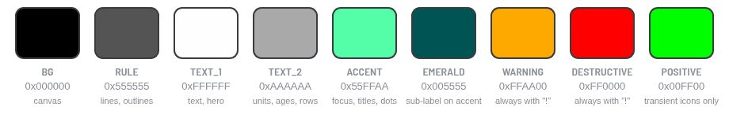

*The nine tokens as the 64-colour panel shows them.*

**There is one accent, and it is Škoda Electric Green.** `0x55FFAA` is
`#78FAAE` as the panel shows it, by the owner's decision of 2026-10-07
([Branding](../decisions.md#branding)). It marks titles, focus and progress
(the ring while charging). It is never used for a warning, a success or a
state; a charging chip is accent-filled because charging is the app's own
"active" state, and it says "Charging" in words as well.

**Amber and red always come with "!" or an icon.** The colour is a second
signal, not the first. `Chips.iconFor()` forces the "!" on `:warn` and
`:error` chips whatever icon was asked for, `Ui.drawStatusLine()` adds "! " to
`:warn` and `:error` lines that lack one, and `Age.line()` puts it on stale
ages. Stale data is amber, not red: red is kept for failures, so an old
reading never looks like an error.

**Green is for transient success only.** `Theme.POSITIVE` appears in a
Garmin toast or a `Bezel.hintArc(dc, btn, :positive)`, never as text and never
for a lasting state. Today no screen draws it; "Command sent" is white text.

**Never put text on a grey fill.** Grey on the MIP panel is a dither and text
on it breaks up in sunlight. A neutral chip is an outline in `RULE` with white
text; a filled chip is amber, red, accent or white with black text.

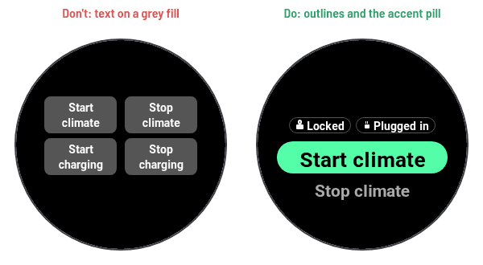

*Don't put text on a grey fill; use an outline or the accent pill.*

**Draw every colour through `Theme.c()`.** It returns the colour unchanged
normally, and under the monochrome test turns everything except black and
transparent into white. A view that calls `dc.setColor(Theme.WARNING, ...)`
directly is invisible to the test. Black is the one colour you may pass raw
(`Theme.BG` for text on a fill). The few shapes that change under the test
ask `Theme.isMono()`: the focus pill turns white and the emerald sub-label
turns black.

**Switch the monochrome test on and look.** The SDK cannot read pixels back,
so the test is a switch, not an assertion (`MonochromeTest.mc`). In the
simulator, open File, Edit Persistent Storage, and set the Storage key
`monochromeTestEnabled` (`MonochromeTest.STORAGE_KEY`) to `true`. Views read
the flag in `onShow()` through `Theme.refresh()`, so leave the screen and come
back. Every state must still be identifiable: by a word, an icon, "!", or a
shape such as the larger current page dot.

**Orange is retired.** `COLOR_ORANGE` and `0xFF5500` used to mean both
"error" and "unlocked". `tools/checks.py` ("No orange in the app") fails the
build on either in code.

## 4. Type

All type is the watch's own system fonts, measured at run time: fēnix 8 and 9
scale them between 0.8 and 1.45, and the fr955 uses another set. Measured
heights in pixels:

| Device | `FONT_MEDIUM` | `FONT_SMALL` | `FONT_TINY` | `FONT_XTINY` |
|---|---|---|---|---|
| fēnix 7 Pro | 37 | 32 | 29 | 19 |
| fēnix 8 Solar 47 mm, fr955 | 39 | 32 | 29 | 21 |

Each role has one font:

| Role | Font | Colour | Drawn by |
|---|---|---|---|
| Screen and menu title | `FONT_TINY`, sentence case | `ACCENT` | `Ui.title()`, `NightMenu.drawTitle()` |
| Hero number | `FONT_NUMBER_MEDIUM`; `FONT_NUMBER_MILD` when number and unit outgrow the chord; on home whatever fits the 98 px hero (`FONT_NUMBER_MILD` on a 260 px display) | `TEXT_1` | `Ui.drawValueWithUnit()` |
| Unit | `FONT_MEDIUM`; `FONT_SMALL` next to `FONT_NUMBER_MILD` and on the home hero | `TEXT_2`, same baseline | `Ui.drawValueWithUnit()` |
| Hero word | `FONT_MEDIUM`, optional icon r 12 in front | `TEXT_1`, or `WARNING` when insecure | `Ui.drawHeroWord()` |
| Focused row | Largest of `FONT_MEDIUM`, `FONT_SMALL`, `FONT_TINY` that fits; `FONT_SMALL` or `FONT_TINY` with a sub-label | `BG` on `ACCENT` | `NightMenuItem` |
| Row sub-label | `FONT_XTINY` | `EMERALD` | `NightMenuItem` |
| Unfocused row | `FONT_TINY` | `TEXT_2`, icon `ACCENT` | `NightMenuItem` |
| Chips, ages, status lines, detail lines | `FONT_XTINY` | per kind | `Chips`, `Ui.drawStatusLine()`, `ChargingFormat.drawLines()` |
| Empty state | `FONT_SMALL`, then one `FONT_XTINY` line | `TEXT_1`, then `TEXT_2` | `StatusPages._drawEmpty()` |
| Onboarding text | `FONT_SMALL` when it wraps to four lines or fewer, else `FONT_XTINY` | `TEXT_1` | `OnboardingLayout.choose()` |

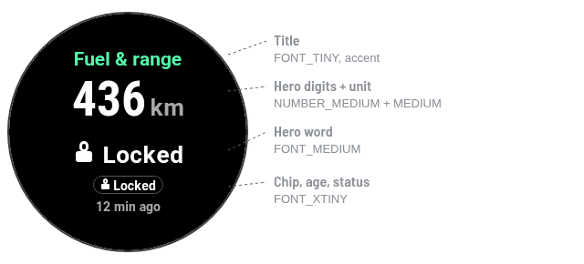

*Title, hero number with unit, hero word, rows, chips and age lines in their
fonts.*

**Digits go in the number fonts, and nothing else does.** `FONT_NUMBER_*`
only has the glyphs in `Ui.NUMBER_GLYPHS`, `" #%+-./0123456789:°"`. A letter
or the `—` placeholder draws as a box or nothing. `Ui.drawValueWithUnit()`
checks the value with `Ui.isNumberGlyphs()` and falls back to `FONT_MEDIUM`
when it fails, so a missing SoC shows `—` in a text font rather than an empty
box. The unit is always a separate string in a text font, because "km", "C"
and "F" are not in the number fonts either.

**Words are heroes in `FONT_MEDIUM`.** "Locked", "Heating" and "Car is
moving" use `Ui.drawHeroWord()`. In 1.0 the lock state was "LOCKED" in the
number font, which the watch drew as missing-glyph boxes.

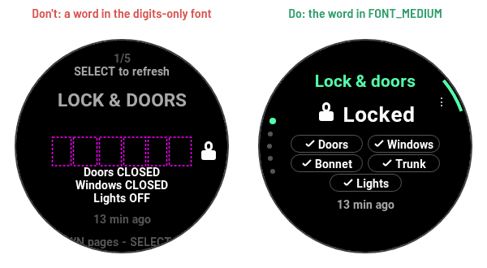

*Don't put a word in a number font; use the word hero.*

**Measure fonts, never assume them.** A width that fits on the fēnix 7 Pro
overruns on a fēnix 8. Pick from a list, largest first, with `Ui.pickFont()`,
then `Ui.fit()` the result; size rows with `Theme.rowHeight()` (see
[A list shows three rows](#5-layout-on-a-round-screen)) and chips with
`Chips.height()` (`FONT_XTINY` plus 2, at least 20).

```monkeyc
Ui.title(dc, "Fuel & range", 34);
Ui.drawValueWithUnit(dc, 130, 64, "436", "km",
    Graphics.FONT_NUMBER_MEDIUM, Graphics.FONT_MEDIUM, Theme.TEXT_1);
```

```monkeyc
// A word hero with its state icon, amber only when the word says so too.
var raw = values.get("doorsLocked") as String?;
var color = Labels.isInsecureLock(raw) ? Theme.WARNING : Theme.TEXT_1;
Ui.drawHeroWord(dc, 130, 70, Labels.lock(raw), StateIcons.forLockStatus(raw), color);
```

## 5. Layout on a round screen

All six targets share one 260×260 round face, centre (130, 130). The usable
width at any height is a chord, 260 pixels across the middle and about 84 near
the edge ([decisions.md](../decisions.md#a-round-display-is-not-a-rectangle)).

**Every line is fitted to the chord at its own y.** Measure the glyph box
from top to bottom, ask for the usable width there, and fit the text to it.
`Ui.usable(top, bottom, margin)` returns the width for a box, using the edge
furthest from the centre; `Ui.fit()` cuts by pixels with "…" and never
returns anything wider; `Ui.wrapFit()` wraps to per-line widths and puts "…"
on the last allowed line. The geometry underneath is `TextBlock.halfChord()`
and `TextBlock.lineWidth()`; the method is in
[C8](ui-improvements.md#c8-how-to-check-a-layout-fits).

```monkeyc
var font = Graphics.FONT_XTINY;
var y = 160;
var h = dc.getFontHeight(font);
var s = Ui.fit(text, Ui.usable(y, y + h, Theme.RING_MARGIN), Ui.measurer(dc, font));
dc.setColor(Theme.c(Theme.TEXT_1), Graphics.COLOR_TRANSPARENT);
dc.drawText(130, y, font, s, Graphics.TEXT_JUSTIFY_CENTER);
```

**Use the margin that belongs to the screen.** The margin is taken inside the
chord on both sides.

| Constant | px | Where |
|---|---|---|
| `Theme.MARGIN` (`TextBlock.MARGIN`) | 8 | Default, and `Ui.title()` and `Ui.drawStatusLine()` |
| `Theme.RING_MARGIN` | 12 | Next to the SoC ring or a ring track: the home hero, charging detail rows, status page lines, unfocused menu rows, Find my car |
| `OnboardingLayout.MARGIN` | 12 | Onboarding text without a bezel glyph |
| `OnboardingLayout.GLYPH_MARGIN` | 26 | Onboarding text with a glyph at UP or START |

Find my car measures inside its ring track (r 124) with
`FindCarLayout.chordWidth()`, not on the full circle.

**The bezel zone holds only arcs, dots and glyphs.** From r 108 outwards
there is no text. Angles are canvas degrees (0 at 3 o'clock, clockwise);
`Bezel.ciqDegrees()` is the one conversion to `Dc.drawArc`'s convention.

| Part | Radius | Detail |
|---|---|---|
| SoC ring | r 126, pen 4 | `RULE` track, fill clockwise from 12 o'clock, white tick at the charge limit (r 119 to 129) |
| Find my car track | r 125, pen 2 | `RULE`; text measured inside r 124 |
| Hint arcs | r 126, pen 4 | ±10° around a button |
| Bearing pointer | r 117 to 129 | Accent wedge, apex outward |
| Page dots | r 118 | Centred on 9 o'clock, 7.5° apart |
| Button glyphs | r 108 | Icon r 6 |
| Buttons | | START at -30°, BACK at 30°, DOWN at 150°, UP at 180° |

**Titles sit at y 34.** That is where `FONT_TINY` still has about 158 pixels.
A title that needs more moves down rather than shrinking: "Charging profiles"
sits at y 40 and "Target temperature" at y 48. Find my car has no title; the
row that opened it says where you are.

**Use the same y positions as the existing screens.** These are the tops of
the glyph boxes, checked against the chord:

| Screen | Positions |
|---|---|
| Status (`StatusPages`) | title 34, hero number 64, hero word 70, chip grid 116, lines 142 (air conditioning 128), age 192, status 212; empty state 98 and 136 |
| Charging (`ChargingDetailView`) | title 34, hero 58, state chip 134, detail rows 160 and 180, age 202 |
| Find my car (`FindCarLayout`) | address 46, distance 88, "Waiting for GPS" 112, age 172; moving: hero 90, "Last parked" 130, address 150 |

**A list shows three rows, close together.** `Theme.rowHeight()` is a
quarter of the display, 65 on these watches (never less than `FONT_MEDIUM`
plus 16), and a `CustomMenu` draws only the focused row in the middle and
one row above and one below (`NightMenuLayout.isShown()`); every other row,
and the title once the first row has scrolled up, is left blank. Which row
has the focus is tracked by `NightMenuFocus`: it starts at the focus the
list opens on and follows only the row being drawn reporting its own
`isFocused()`, because the watch does not answer that reliably for the
other rows (1.1.2 asked every row, and lists opened blank). Rows sized
from the font (53 to 55 px in 1.1.0) showed five, the outer two cut off by
the round edge; rows of 80 px (1.1.1) kept three but spread them over the
whole face. When the focus moves, the list scrolls a row: the row at one end
leaves and the next one comes in at the other. The focus pill follows its
text (`NightMenuLayout.pillHeight()`: 51 px, 59 with a sub-label, at most
the row minus 3 px each side) and sits centred in the row; the rows above
and below are fitted to the chord one row from the centre
(`NightMenuLayout.neighbourWidth()`), which is narrower than the middle.

**The home hero is laid out from the bottom up.** It lives in the title area
of the home `CustomMenu`, `Theme.HOME_TITLE_H` (98) pixels high: exactly
`Theme.heroBottom()`, the part above the focused row that is on screen when
the first row is focused. `HomeHero.slots()` places the status line just
above the focused row, the chips above that, then the SoC in the largest of
`FONT_NUMBER_MEDIUM`, `FONT_NUMBER_MILD` and `FONT_MEDIUM` whose digits stay
below y 12 (`HomeHero.MIN_DIGIT_TOP`) and fit the chord; in 98 px that is
`FONT_NUMBER_MILD`. From the second row on, the hero is left blank like any
row two away from the focus. Chips that do not fit are dropped from the end; the lock chip
comes first and goes last (`HomeHero.chipsToKeep()`).

**Text hints at the bottom are gone.** In 1.0 a hint at `height - 20` had
about 84 pixels for text that needed 150. A button now gets a glyph and,
where it is the main action, a hint arc.

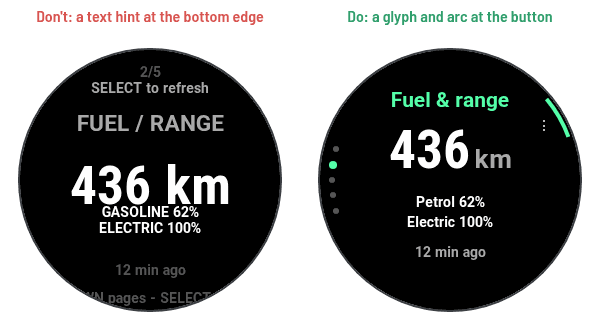

*Don't put a text hint at the bottom edge; put a glyph and an arc by the
button.*

## 6. Components

### Hero value and hero word

`Ui.drawValueWithUnit(dc, cx, y, value, unit, numFont, unitFont, color)`
draws the number and its unit centred on `cx`, the unit in `TEXT_2` on the
number's baseline, `Ui.UNIT_GAP` (4) pixels apart, and returns the total width
so an icon can sit beside it. `y` is the top of the number box. `unit` may be
`null`.

`Ui.drawHeroWord(dc, cx, y, word, icon, color)` draws a `FONT_MEDIUM` word
with an optional icon (r 12) in front and returns the width.

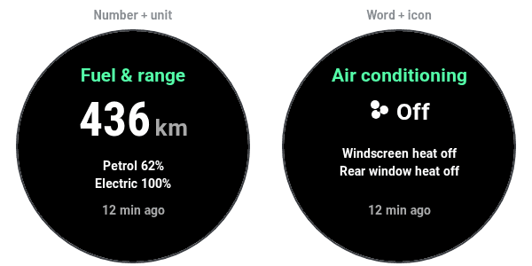

*Number hero with its unit, and word hero with its icon.*

Use a number hero for a measured value (range, SoC, distance, odometer,
temperature) and a word hero for a state (lock, climate, "Car is moving").
When the number font and unit outgrow the chord, step down to
`FONT_NUMBER_MILD` with a `FONT_SMALL` unit, as `StatusPages._drawValue()`
and `LocationView._drawDistance()` do.

### Chips

A chip is a pill `Chips.height()` high with an optional icon (r 6) and one
word in `FONT_XTINY`. At most three in a row. `Chips.Chip(text, icon, kind)`
has five kinds:

| Kind | Look | Use |
|---|---|---|
| `:outline` | `RULE` outline, white text | A normal, secure state: "Locked", "Plugged in", "Heating" |
| `:warn` | Amber fill, black "!" and text | Insecure or needs action: "Unlocked", "Plug in", "Trunk" open |
| `:error` | Red fill, black "!" and text | A failure shown as a chip |
| `:accent` | Accent fill, black icon and text | Charging, the active state |
| `:white` | White fill, black text | Neutral emphasis: "Here" on the charging profile where the car is parked |

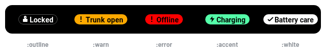

*Outline, warn, error, accent and white chips.*

Build chips from API values with `Chips.forLock()`, `Chips.forCharging()`
and `Chips.forClimate()`; each returns `null` when there is nothing worth a
chip, so the row shows nothing rather than `—`. Draw a centred row with
`Chips.drawRow()`, or one chip with `Chips.draw()`. `Chips.width()` and
`Chips.rowWidth()` are pure, for tests.

```monkeyc
var chips = [] as Array<Chips.Chip>;
var lock = Chips.forLock(lockRaw);
if (lock != null) {
    chips.add(lock);
}
var plug = Chips.forCharging(chargingRaw);
if (plug != null) {
    chips.add(plug);
}
Chips.drawRow(dc, 96, chips, 6);
```

The status lock page draws the same chips in a fixed 2×3 grid
(`StatusPages._drawGrid()`), open items first.

### Menus

Every list is a `NightMenu`, a `WatchUi.CustomMenu` drawn in the Night Panel
style, because `Menu2` cannot be recoloured on these watches. Garmin keeps
the scrolling, focus animation and key and touch handling; only the pixels
are ours ([B6](ui-improvements.md#b6-navigation-model)).

- `NightMenu(title, focus, titleHeight)`: accent `FONT_TINY` title with a
  1 px rule under it; `focus` is the row focused on open; `titleHeight`
  `null` keeps the platform's.
- `NightMenuItem(id, label, sub, icon, checked)`: the focused row is an
  accent pill (white under monochrome) with black text, an optional emerald
  sub-label and a black icon, sized from its text and centred in the 65 px
  row; the rows above and below are grey `FONT_TINY` with an accent icon,
  fitted to the chord one row off the centre, and keep their sub-label (grey
  `FONT_XTINY`) and check. `checked`
  `null` means no check column; `true` or `false` make it a
  choice row. `setText()`, `setSub()` and `setChecked()` update a row in
  place, so the focus survives.
- `NightMenuDelegate(popOnSelect)`: override `onPick(id)`. Pass `true` for
  pickers and action lists whose result appears on the screen underneath
  (the menu pops first, so a confirmation or toast lands there); `false`
  when the menu stays up, as on home. BACK slides right.

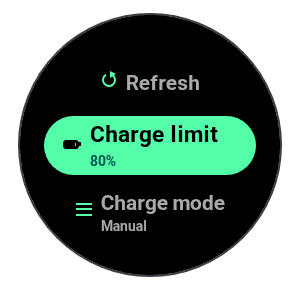

*Three rows close together: the focused pill with a sub-label, and one grey
row above and below with accent icons. The fourth row (Profiles) and the
title are off screen until the focus reaches them.*

```monkeyc
function openMenu() as Void {
    var menu = new NightMenu("Charging", 0, null);
    menu.addItem(new NightMenuItem("refresh", "Refresh", null, :refresh, null));
    menu.addItem(new NightMenuItem("limit", "Set charge limit", "80%", :battery, null));
    menu.addItem(new NightMenuItem("profiles", "Charging profiles", null, :list, null));
    WatchUi.pushView(menu, new ChargingActionMenuDelegate(self), Theme.SLIDE_IN);
}
```

```monkeyc
class ChargingActionMenuDelegate extends NightMenuDelegate {

    private var _view as WeakReference;

    function initialize(view as ChargingDetailView) {
        NightMenuDelegate.initialize(true);
        _view = view.weak();
    }

    function onPick(id as Object?) as Void {
        var view = _view.get() as ChargingDetailView?;
        if (view != null && id instanceof String && (id as String).equals("refresh")) {
            view.refresh();
        }
    }
}
```

Keep action lists short, about seven rows
([best practices](../best-practices/garmin-connect-iq.md#3-interaction-and-interface));
home is the exception, where every action is a row. Show a current value as a
sub-label ("80%", "Recommended", the charge mode) rather than in the label.
Hold the view in a delegate as a `WeakReference`.

### Status line and age line

`Ui.drawStatusLine(dc, y, text, kind)` draws one centred `FONT_XTINY` line,
fitted to the chord, and returns its bottom y. The kind sets the colour:

| Kind | Colour | Use | Example |
|---|---|---|---|
| `:age` | `TEXT_2` | The age of the data, progress | "12 min ago", "Refreshing…" |
| `:sent` | `TEXT_1` | A command went out | "Command sent" |
| `:warn` | `WARNING`, "! " added | Stale, quota low, a warning after sending | "! 17 h ago" |
| `:error` | `DESTRUCTIVE`, "! " added | Failure, phone not connected, quota spent | "! Phone not connected" |

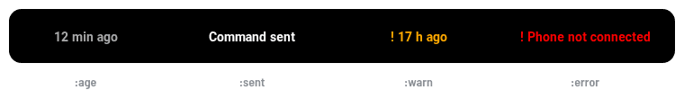

*The four kinds of status line.*

`Age.line(seconds)` gives the age text: "No data" for `null`, "! " in front
once stale. Pass the capture time of the section the value came from, never
a global one.

```monkeyc
var seconds = Age.elapsed(page.capturedAt, Time.now().value());
var stale = seconds != null && Age.isStale(seconds);
Ui.drawStatusLine(dc, 192, Age.line(seconds), stale ? :warn : :age);
```

A screen has one place for feedback. On home it is the hero's status line,
where the last command result wins over a missing phone, which wins over the
age (`HomeHero.statusLine()`). On Status it is a second line under the age;
on Charging a transient line takes a free detail row, or replaces the age
when both rows are used.

### Bezel parts

| Call | Draws |
|---|---|
| `Bezel.ring(dc, frac, fill, tickFrac)` | SoC ring: track, fill from 12 o'clock, optional limit tick; `fill` is `TEXT_1`, or `ACCENT` while charging |
| `Bezel.pageDots(dc, idx, count)` | Page indicator on the left: current dot r 4 in the accent, others r 3 in `RULE`, so size marks the page under monochrome |
| `Bezel.hintArc(dc, btn, kind)` | A 20° band next to a button; kinds `:dark`, `:accent`, `:positive`, `:destructive` |
| `Bezel.glyph(dc, btn, icon, color, arcKind)` | A small icon at r 108 next to a button, with an optional hint arc |
| `Bezel.pointer(dc, angleRad, filled)` | Find my car bearing; outline while there is no compass heading |

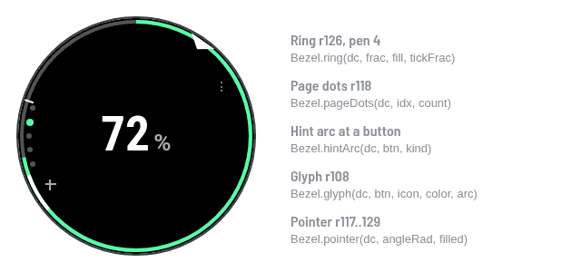

*Ring, page dots, hint arc, glyphs and the bearing pointer.*

```monkeyc
Bezel.ring(dc, 0.8, Theme.ACCENT, 0.9);
Bezel.pageDots(dc, 0, 5);
Bezel.glyph(dc, Bezel.BTN_START, :menu, Theme.TEXT_1, :accent);
```

Give START a glyph when it opens something, and an accent hint arc when it is
the screen's main action (the map on Find my car). Leave the arc out where it
would sit on the SoC ring. BACK needs neither.

### Icons

One family of solid silhouettes with black cut-outs; thin outlines fade on
the MIP panel. Draw any of them with
`NightIcons.draw(dc, name, cx, cy, r, color)`, where `r` is the half size.

| Family | Names |
|---|---|
| Action (`NightIcons`) | `:battery`, `:range`, `:fan`, `:pin`, `:list`, `:gear`, `:stop`, `:refresh`, `:check`, `:cross`, `:bang`, `:plus`, `:minus`, `:menu`, `:map`, `:thermo`, `:bolt` |
| State (`StateIcons`) | `LOCKED`, `UNLOCKED`, `OPEN`, `CHARGING`, `PLUGGED_IN`, `CLIMATE_ACTIVE`, `UNKNOWN` |

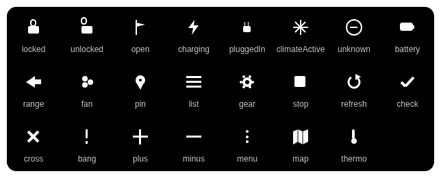

*Action and state icons.*

State icons pass through `NightIcons.draw()` to `StateIcons.draw()`, so there
is one drawing per state; `:bolt` is the charging icon. Map an API value to
its icon with `StateIcons.forLockStatus()`, `forChargingStatus()` and
`forClimateStatus()`. An unknown name draws the `UNKNOWN` icon rather than
nothing. The glance draws `StateIcons` directly and cannot use `NightIcons`.

**The app icon is a steering wheel.** `app/resources/drawables/launcher_icon.svg`
is 40 by 40 on every watch, with no background shape: it sits on the black the
system draws in the app list and the glance list. The rim and spokes are
Electric Green (`#55FFAA`), the hub's face Emerald (`#005555`) with a green
edge, because Emerald on its own all but vanishes on black. Both colours sit
exactly on the 64-colour grid, and `dithering="none"` keeps them. Nothing in
it is thinner than 3 px. It is an original drawing, not the Škoda arrow
([Branding](../decisions.md#branding)).

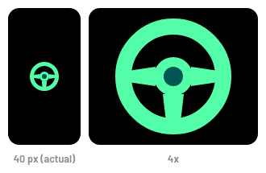

*The app icon at 40 px and enlarged.*

### Native parts that stay native

**Confirmations go through `ConfirmationPolicy`.** Never push a
`WatchUi.Confirmation` for a command yourself. `ConfirmationPolicy.run()`
asks first for the actions that interrupt something or burn fuel (stop
charging, start and stop the auxiliary heater, clear data) and for every
action once the quota is low, sends straight away otherwise, vibrates once,
and calls your announce method either way.

```monkeyc
ConfirmationPolicy.run(ConfirmationPolicy.STOP_CHARGING, "Stop charging?",
    method(:_send), method(:_announce));
```

The one confirmation outside it is `NavigateConfirm`, because navigating
closes the app; it is pushed with `Theme.SLIDE_DIALOG`.

**Toasts are a bonus, guarded with `has`.** The status line carries the
feedback that matters; the toast repeats it where the firmware has one.

```monkeyc
if (WatchUi has :showToast) {
    WatchUi.showToast(Commands.SENT, null);
}
```

## 7. Interaction

The navigation model and why it changed are in
[decisions.md](../decisions.md#night-panel-navigation). In short: home is a
list with a hero that wraps at both ends; Charging and Status are rows in
it, and nothing opens until START.

### The main screens

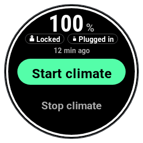

*Rendered from the proof of concept (card `home-mock`, variant b), which
follows the app's home geometry: the hero in the 98 px above the focused
row, rows of 65 px with only the focused one and its neighbours drawn.*

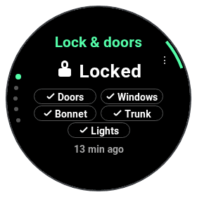

*Rendered from the proof of concept (card `st-lock`). In the app a stale age stays `FONT_XTINY` (the proof of concept uses
`FONT_TINY`), and a refresh or error line appears under the age at y 212.*

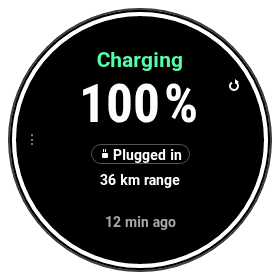

*Rendered from the proof of concept (card `ch-detail`). In the app START
shows a menu
glyph instead of the refresh glyph and UP shows none (START, MENU and a tap
all open the list), and a transient line takes a free detail row.*

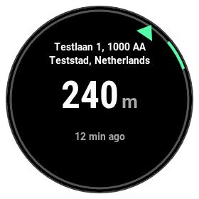

*Rendered from the proof of concept (card `fc-parked`). In the app the
track is 2 px,
the pointer runs from r 117 to 129, and phone and fetch errors appear under
the age.*

### Buttons and touch

| Screen | UP / DOWN | START | MENU (hold UP) | BACK | Touch |
|---|---|---|---|---|---|
| Home (`HomeMenu`) | Move the focus, wrapping at both ends; nothing opens until START | Runs the focused row | | Leaves the app | Swipe scrolls; a tap on a row runs it; a tap on the hero opens Status |
| Status pages | Previous and next page, wrapping | Opens Actions: Refresh, plus Charging details on the charging page | | Home, sliding down | Swipes page; a tap does nothing |
| Charging detail | | Opens the charging list: Refresh, Set charge limit, Set charge mode, Charging profiles | Same list | Back | A tap opens the same list |
| Menus (`NightMenu`) | Move the focus | Picks the row | | Closes, sliding right | Swipe scrolls; a tap picks |
| Find my car | | Opens the map (accent arc when it can) | Navigate (when parked), Refresh | Back | A tap arrives as START |
| Map | | Pan and zoom mode | Navigate to car | Pan and zoom mode to preview, then back | The map's own |
| Target temperature | UP +1, DOWN -1, saved at once | | | Back | Swipe up +1, swipe down -1 |
| Onboarding | | The screen's action: open the key page, retry, or continue | Onboarding menu (glyph at UP) | | |

Use `BehaviorDelegate`, never `InputDelegate`, and do not remap BACK. The
map's two-step BACK is the one exception, copied from Garmin's own
MapSample.

**Transitions come from `Theme`.** A drill-in slides left and its way back
slides right; Status rises from below and Charging comes down from above,
matching the buttons that open them.

| Constant | Slide | Use |
|---|---|---|
| `Theme.SLIDE_IN` | `SLIDE_LEFT` | Opening a menu, Find my car, the map, a sub-screen |
| `Theme.SLIDE_OUT` | `SLIDE_RIGHT` | Closing a menu |
| `Theme.SLIDE_STATUS` | `SLIDE_UP` | Opening Status, next status page |
| `Theme.SLIDE_CHARGING` | `SLIDE_DOWN` | Opening Charging, previous status page, back from Status |
| `Theme.SLIDE_DIALOG` | `SLIDE_IMMEDIATE` | Confirmations |

`tools/checks.py` ("No vertical slide in menu delegate files") fails on a
`SLIDE_UP` or `SLIDE_DOWN` literal in any file that defines a menu delegate;
that is how the old menus ended up sliding down. Write the `Theme` name.

**The primary action has the focus at launch, and focus survives a
return.** Home is created once and focuses the primary action
(`HomeRows.build()`, US-037). When you come back to it, the rows are rebuilt
only if they changed, so the row you left is still focused. A picker opens on
the current value (`ChargingLogic.limitIndexFor()`). Update a row with
`NightMenuItem.setText()` or `setSub()` rather than rebuilding the menu.

**A tap on a screen never spends quota.** A refresh costs one of 20 requests
an hour and a tap is easy to make by accident. Status consumes the tap;
Charging turns it into "open the list". In a list, one tap on a row runs it,
the same as START.

**Ask only when it costs something.** Confirmations come from
`ConfirmationPolicy` (see [Native parts](#native-parts-that-stay-native)) and
from `NavigateConfirm`. Phrase them as a yes or no question.

## 8. Copy and wording

**Sentence case everywhere.** "Lock & doors", "Set charge limit", "Car is
moving". No capitals for emphasis; the only words in capitals are button
names in hints.

**Words, never raw enums.** Every API value goes through `Labels`, one or two
words so it fits a chip. A value the app has never seen is humanised
("SOME_NEW_VALUE" becomes "Some new value"), never shown raw and never
"Unknown"; `null` is `—`.

| Function | API value to word |
|---|---|
| `Labels.lock()` | YES Locked, NO Unlocked, OPENED Open, TRUNK_OPENED Trunk open, UNKNOWN Unknown |
| `Labels.charging()` | CHARGING Charging, READY_FOR_CHARGING Plugged in, CONNECT_CABLE Plug in, CHARGING_INTERRUPTED Paused, CONSERVING Conserving, DISCHARGING Discharging |
| `Labels.chargeType()` | AC AC, DC DC fast, OFF Not charging |
| `Labels.engine()` | GASOLINE Petrol, ELECTRIC Electric, DIESEL Diesel, CNG Gas |
| `Labels.climate()` | OFF Off, HEATING Heating, COOLING Cooling, VENTILATION Ventilating, HEATING_AUXILIARY Aux heating |
| `Labels.openClosed()` | CLOSED Closed, OPEN Open, ON On, OFF Off |
| `Labels.mode()` | MANUAL Manual, TIMER Timer, TIMER_CHARGING_WITH_CLIMATISATION Timer + climate, PREFERRED_CHARGING_TIMES Preferred times, ONLY_OWN_CURRENT Own power only, IMMEDIATE_DISCHARGING Immediate discharging, HOME_STORAGE_CHARGING Home storage |
| `Labels.maxCurrent()` | MAXIMUM Maximum, REDUCED Reduced |
| `Labels.day()` | MONDAY Mon, TUESDAY Tue, and so on to SUNDAY Sun |

**Ages have one format.** `Age.short()` for chips and the glance: "Just
now", "5 min", "2 h", "3 d". `Age.text()` for age lines adds "ago" ("5 min
ago"), except "Just now". Stale is `Age.line()`: "! 17 h ago".

**Warnings and errors start with "! ".** `Ui.drawStatusLine()` and
`Chips.iconFor()` add it for you; write it yourself only when you draw the
line some other way.

**Numbers with their units.** A space between number and unit in text, none
before "%": "436 km", "80%", "36 km range", "Petrol 62%", "Full in 95 min",
"Full by 18:40 (95 min)". Join two facts with " · " (`ChargingFormat.SEP`):
"7.2 kW · AC". On a hero the unit is a separate string and the gap is
`Ui.UNIT_GAP`, so "21 °C" is "21" and "°C".

**Feedback says what happened, not what we hope.** A command reports "sent";
only the car's own report afterwards may say "Climate on", never the app on
its own word ([decisions.md](../decisions.md#commands-report-sent-never-succeeded),
[One check after a command](../decisions.md#one-check-after-a-command)).

| Situation | Text | Source |
|---|---|---|
| Command went out | "Command sent" | `Commands.SENT` |
| Command accepted, check pending | "Sent, checking the car…" | `CommandCheck.CHECKING` |
| Car reported the change | "Climate on", "Charging stopped", "Limit set to 80%" (`:sent`) | `CommandCheck.verdict()` |
| Car reported something else | "Car reports: Off" (`:warn`) | `CommandCheck.verdict()` |
| Car has not reported since | "Sent; the car has not reported yet" (`:age`, never red) | `CommandCheck.NOT_YET` |
| Start charging without a cable | "Sent: no cable appears to be connected" | `Commands.CABLE_WARNING` |
| Command failed | "Not sent (422): " and the reason | `Commands.failureText()` |
| No quota left | "Quota spent for this hour" | `Commands.QUOTA_SPENT` |
| Quota nearly spent | "Low: ~2 left (est.)" | `StatusModel.statusLine()` |
| Fetching | "Refreshing…" | `StatusModel`, `ChargingDetailView`, `LocationView` |
| No phone | "Phone not connected" | `Commands.NO_PHONE` |
| Refresh or charging setting refused | The reason as a toast: the rows above, "Already refreshing" or "Not set up yet" | `Refusal.text()` |

**Empty states are two lines.** The first says what is missing in
`FONT_SMALL`; the second, in grey `FONT_XTINY`, names the button in capitals
when there is something to do: "No data yet" / "START to refresh",
"Unavailable" / "START to try again". When there is nothing to do, the second
line finishes the sentence: "Switched off" / "for this car", "Not supported"
/ "by this car". Never show a screen of dashes.

**Leave out what you do not know.** A detail row whose data the car did not
send is left out, never shown as `Label: —`
([C3](ui-improvements.md#c3-charging-detail)). The `Labels.DASH` glyph, `—`,
is only the placeholder for one missing value, such as an unknown SoC.

**Cut by pixels with "…".** `Ui.fit()` and `Ui.wrapFit()` measure, so
nothing is cut by character count and nothing runs into the bezel.
`Labels.ELLIPSIS` is the single "…" glyph, not three full stops.

**Questions end with "?" and say the consequence.** "Stop charging?", "Set
limit to 80%?", "Navigate to the car? This closes the app."

**British spelling and words.** Colour, centre, petrol, windscreen, bonnet.

## 9. Checklist for a new or changed screen

- [ ] Every line and box is fitted to the chord at its own y (`Ui.usable`,
  `Ui.fit`, `Ui.wrapFit`, `FindCarLayout.chordWidth`), with the screen's
  margin.
- [ ] Every fixed string has a `TextBlockTests` case (or a test next to the
  screen's own layout code), so longer copy fails the tests.
- [ ] Only digits in `FONT_NUMBER_*`; values go through
  `Ui.drawValueWithUnit()`, which falls back for `—`.
- [ ] Every colour goes through `Theme.c()`; no hex literals in views.
- [ ] Checked with the monochrome test switched on; every state is still
  readable.
- [ ] Warnings and errors carry "!" or an icon; green appears only as
  transient success.
- [ ] API values go through `Labels`, ages through `Age`, each with its own
  section's capture time.
- [ ] Lists are `NightMenu`s with a `NightMenuDelegate`; delegates hold views
  as `WeakReference`s.
- [ ] Transitions use the `Theme.SLIDE_*` constants.
- [ ] No `loadResource` in `onUpdate()`; strings, icons and colours are
  prepared in `onShow()` or the response callback.
- [ ] Commands go through `ConfirmationPolicy.run()`; a tap never spends
  quota.
- [ ] Pure logic has unit tests.
- [ ] `tools/ciq build --all`: clean, no warnings.
- [ ] `tools/ciq test`: all tests pass.
- [ ] `python3 tools/checks.py`: passes.
- [ ] Looked at it on the watch. The simulator clips less than the hardware
  does ([decisions.md](../decisions.md#a-round-display-is-not-a-rectangle)).

## 10. Known deviations

Places where the code does not yet follow this guide, or where the app and
the proof of concept differ. Each is an open item to settle in code (or in the
proof of concept) later; this guide describes the rule, not the current
exception. Paths are under `app/source/`.

- [x] **"Phone offline" on home, "Phone not connected" elsewhere.** Every
  screen now says `Commands.NO_PHONE`, "Phone not connected"; home in red
  through `:error`.
- [ ] **Find my car draws a missing phone in amber.**
  `ui/LocationView.mc:446` uses `Theme.WARNING` with a literal "! "; a
  missing phone is `DESTRUCTIVE` everywhere else. Use
  `Ui.drawStatusLine(dc, y, Commands.NO_PHONE, :error)` or its colour.
- [x] **The quota text is repeated as a literal.** The charging menus,
  profiles and Status use `Commands.QUOTA_SPENT` and `Commands.SENT`
  (through `Refusal` where a refusal is worded).
- [ ] **Two slides are literals.** `ui/MapPreviewView.mc:149` pops with
  `WatchUi.SLIDE_RIGHT` instead of `Theme.SLIDE_OUT`, and
  `api/ConfirmationPolicy.mc:80` pushes its confirmation with
  `WatchUi.SLIDE_IMMEDIATE` instead of `Theme.SLIDE_DIALOG`.
- [ ] **Find my car's empty states point at MENU.**
  `ui/LocationView.mc:248` ("MENU to refresh") and `:356` ("MENU to try
  again") name MENU, a long press on UP that this screen marks with no glyph;
  every other empty state names START. Charging's no-data hint
  (`ui/ChargingDetailView.mc:341`, "Refresh from the menu") names no button.
- [x] **Command failures are cut by characters.** The 36-character cut is
  gone; the status line fits the whole reason by pixels.
- [ ] **"%" is a unit on home and part of the number elsewhere.**
  `ui/HomeHero.mc:221` draws "%" as a grey `FONT_SMALL` unit;
  `ui/ChargingDetailView.mc:304` and `ui/StatusPages.mc:188` draw "80%" in
  the number font with no unit.
- [ ] **"Trunk" where British English says "boot".** `ui/StatusPages.mc:20`
  and `ui/Labels.mc:54` follow the API's word, while `Labels.engine()`
  already maps GASOLINE to "Petrol".
- [x] **Home SoC font differs from the proof of concept.** Resolved in 1.1.1:
  the proof of concept now follows the app's home geometry. The proof of
  concept draws "100" in `FONT_NUMBER_MEDIUM` at y 20
  ([C1b](ui-improvements.md#c1b-home-hero--action-list-variant)); the app
  picks the largest number font that clears the ring (`ui/HomeHero.mc:227`),
  which is `FONT_NUMBER_MILD` on the fēnix 7 Pro.
- [x] **Home status line position differs from the proof of concept.**
  Resolved in 1.1.1, as above. The
  proof of concept draws it under the rows at y 218, with a check icon for
  "Sent"; the app draws it in the title area just above the focused row
  (`ui/HomeHero.mc:117`, `:202`), with the text "Command sent".
- [x] **Unfocused rows show their sub-label and check in the app only.**
  Resolved in 1.1.1: the proof of concept's `Ui.menu` draws them too.
  `ui/NightMenu.mc` (`NightMenuItem._drawPlain()`) draws a grey
  `FONT_XTINY` sub-label and the check on every row, as Menu2 did; the
  proof of concept's `Ui.menu` draws them on the focused row only.
- [ ] **Stale age font on Status differs from the proof of concept.**
  [C2](ui-improvements.md#c2-status-pages) and the proof of concept draw a
  stale age in `FONT_TINY` at y 186; the app keeps `FONT_XTINY` at y 192
  (`ui/StatusPages.mc:303`).

## 11. Tools

There are two sets of tools: the app's own, which test the Monkey C code, and
the design reference's, which test the drawings this guide is built from.
Run both before a screen change goes into a pull request.

### In the app

**`tools/ciq test` runs the unit tests in the simulator.** The layout rules
that can be tested without a screen are tested there: the chord maths and
fitted lines (`TextBlockTests`), fitting, number glyphs and font choice
(`UiTests`), chip sizes (`ChipsTests`), the age and label wording
(`AgeTests`, `LabelsTests`) and every line of the onboarding copy against
its chord (`OnboardingTests`). A new screen with fixed text adds a case
here. The command can exit 1 even when every test passes; read the
`PASSED` and `FAILED` counts.

**`tools/ciq run` shows the app, and the mock server shows the states.**
Start `mock/run.sh --scenario <name>` and point the app at it as
[mock/README.md](../../mock/README.md) describes. The scenarios that matter
most for screens:

| Scenario | Shows |
|---|---|
| `default` | the home hero, every status page, charging detail |
| `charging-active` | the accent ring, the Charging chip, the detail rows |
| `connect-cable` | the amber "! Plug in" chip and the cable warning |
| `stale-airconditioning-17h` | the amber stale age on one page only |
| `partial-data`, `unknown-enum` | hidden pages and humanised unknown values |
| `charging-profiles`, `empty-charge-modes` | profile pages, the hidden mode row |
| `parked-with-address`, `parked-no-address`, `in-motion` | find my car states |
| `rate-limit-exceeded`, `quota-nearly-spent`, `503` | errors, confirmations when quota is low |
| `api-key-expired`, `expires-in-20-days` | onboarding screens |

**The monochrome test is a switch, not a script.** In the simulator, open
File > Edit Persistent Storage, set `monochromeTestEnabled` to `true` in the
application storage, and restart the app. Every screen must still say what
it means with all colour gone ([section 3](#3-colour)).

**`python3 tools/checks.py` enforces three of the rules.** No resource
loading in `onUpdate()`, no vertical slides in menu delegates, no orange.
CI runs it on every push.

**The simulator panel may stay blank.** In the Docker setup on some
desktops the simulator loads the app but paints nothing. The tests still
run. Look at the screens on a watch, or use the design reference below.

### The design reference

`docs/design/vozidlo-poc.html` is the Night Panel drawn in a browser: every
screen of 1.0 next to its new version, a pair of working watches under
"Try it" (click the bezel buttons, hold UP for MENU, drag to swipe), and a
Monochrome switch. Open it from a local checkout in Chrome or Firefox;
`#st-lock` and the other card ids work as anchors. It needs no build step.

Its sources live in [tools/ui/poc/](../../tools/ui/poc), one file per area
(`30-new-home.js`, `31-new-status.js`, `32-new-other.js`, and so on), and
three scripts work on them:

| Command | Does | Needs |
|---|---|---|
| `tools/ui/build.sh` | rebuilds `docs/design/vozidlo-poc.html` from the parts | node |
| `tools/ui/build.sh --check` | fails if the page and the parts differ | node |
| `node tools/ui/fitcheck.mjs [prefix]` | checks every new render and simulator state against the circle and this guide | node |
| `tools/ui/render-style.sh` | redraws the images in `docs/design/style/` | Chrome or Chromium, Pillow |

**The fit check is the quick way to know a layout fits.** It runs every
new screen headless and fails on text hidden by the curve, text closer than
12 px to the edge (`EDGE=8` to loosen), text over text or over an icon or
chip, letters in a number font, text on a grey fill, a retired colour, or
any colour but black and white in the monochrome pass. Give it a card id
prefix (`st`, `ch`, `home`) or `sim` to narrow it down.

**Change the reference, then the images, in that order.** Edit the part,
run `tools/ui/build.sh` and the fit check, and when an image in this guide
shows the changed thing, run `tools/ui/render-style.sh`. The examples
themselves are in `tools/ui/poc/style-examples.js`, one function per image.

**CI runs the build check and the fit check.** The "UI design checks" job
in `.github/workflows/build.yml` fails a pull request whose page does not
match its parts or whose drawings break a rule. The images are not
rendered in CI, because that needs a browser and the fonts.
